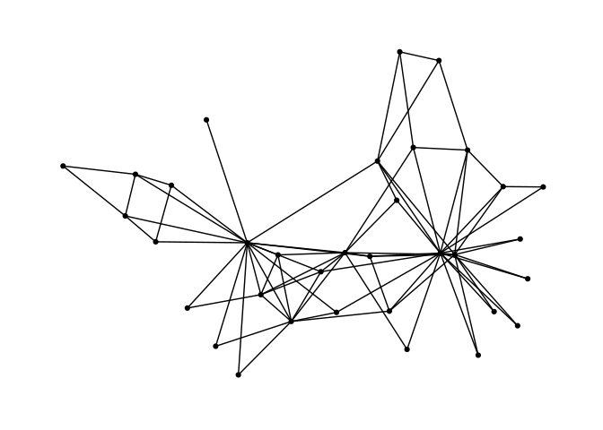
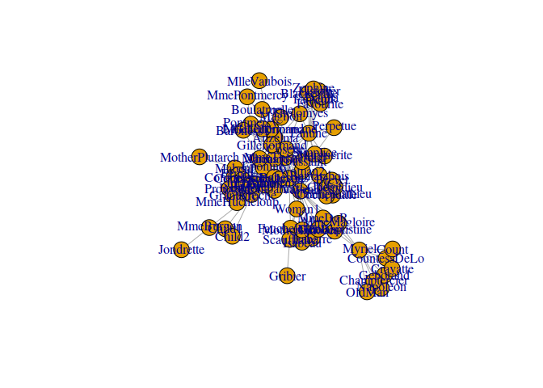
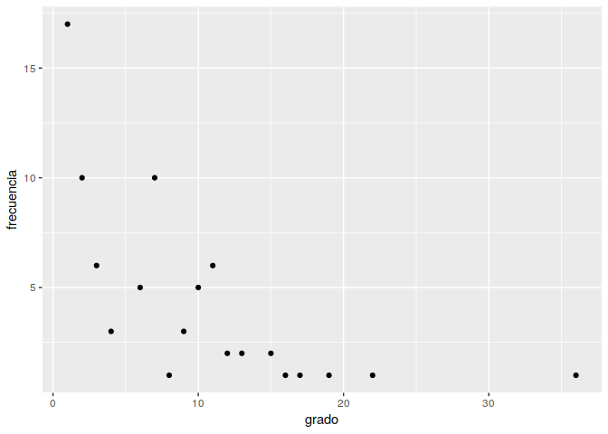
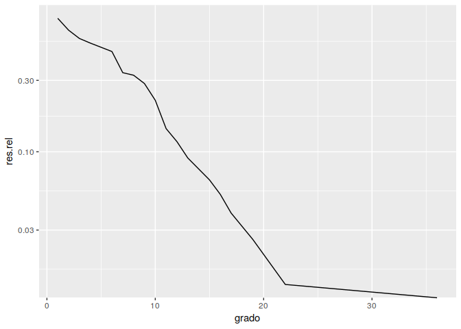
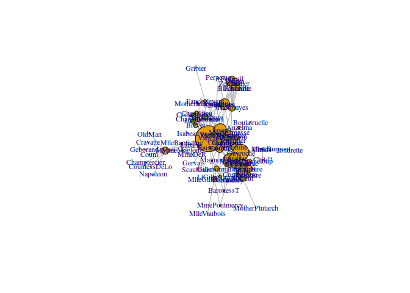
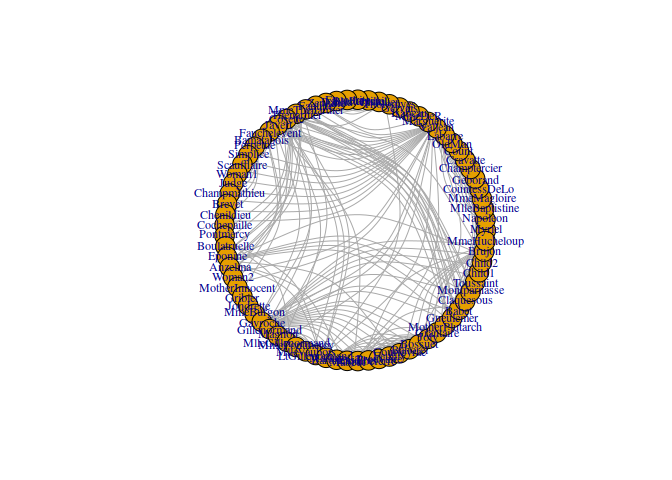
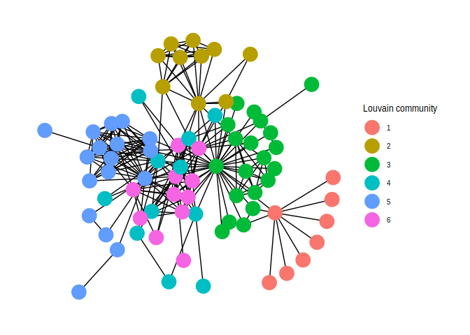
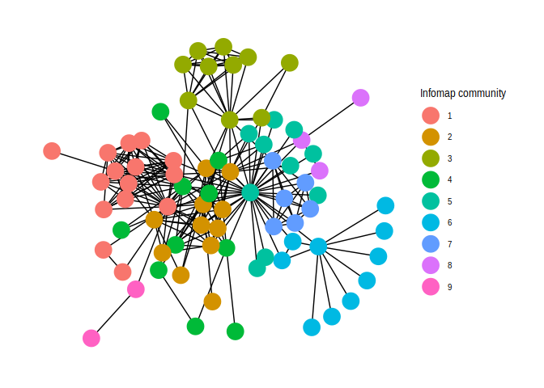
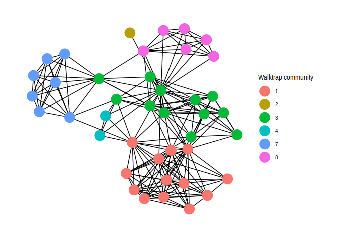

Análisis de redes con R
================
Guilermo de Anda-Jáuregui

Análisis de redes
=================

¿Qué es una red?
================

Una red es un objeto matemático que tiene dos conjuntos:

-   Un conjunto de elementos, representados por *nodos*
-   Un conjunto de relaciones entre los elementos, representados por *enlaces*



¿Qué haremos hoy?
=================

1 Leer una red (y escribirla, de una vez)

2 Describir la red: tamaño, caminos mas cortos, número de componentes, etc.

3 Estudiar propiedades de los nodos: centralidades, coeficientes de agrupamiento locales, etc.

4 Estudiar propiedades de los enlaces: intermediacion

5 Buscar grupos (comunidades)

6 Graficar

7 Hacerlo *tidy*

Iniciemos
=========

carguemos el paquete igraph

``` r
library(igraph)
```

Leer y escribir redes
=====================

-   Descargar datos de <https://raw.githubusercontent.com/guillermodeandajauregui/useR2019INMEGEN/master/les_miserables.gml>

Esta es una red de interacciones de los personajes en la novela de *Los Miserables* (crédito: Donald Knuth, Mark Newman)

**Colocar el archivo en el directorio de trabajo**

Leamos la red usando read.graph
-------------------------------

``` r
g <- read.graph(file = "les_miserables.gml", format = "gml")
```

Considerar que existen varios tipos de formatos de redes.

Examinemos nuestra red

``` r
g
```

    ## IGRAPH 5643230 U--- 77 254 -- 
    ## + attr: id (v/n), label (v/c)
    ## + edges from 5643230:
    ##  [1]  1-- 2  1-- 3  1-- 4  3-- 4  1-- 5  1-- 6  1-- 7  1-- 8  1-- 9  1--10
    ## [11] 11--12  4--12  3--12  1--12 12--13 12--14 12--15 12--16 17--18 17--19
    ## [21] 18--19 17--20 18--20 19--20 17--21 18--21 19--21 20--21 17--22 18--22
    ## [31] 19--22 20--22 21--22 17--23 18--23 19--23 20--23 21--23 22--23 17--24
    ## [41] 18--24 19--24 20--24 21--24 22--24 23--24 13--24 12--24 24--25 12--25
    ## [51] 25--26 24--26 12--26 25--27 12--27 17--27 26--27 12--28 24--28 26--28
    ## [61] 25--28 27--28 12--29 28--29 24--30 28--30 12--30 24--31 31--32 12--32
    ## [71] 24--32 28--32 12--33 12--34 28--34 12--35 30--35 12--36 35--36 30--36
    ## + ... omitted several edges

Nuestra red tiene 77 nodos, con 254 enlaces entre ellos. Es una red *no dirigida* y *no pesada*.

Hagamos una primera visualización

``` r
plot(g)
```



Esta visualización no es muy estética... ya la mejoraremos

Exportemos la red en varios formatos
------------------------------------

### Formato de RDS, solo útil para regresar a R

``` r
#guardar
dir.create("data")
```

    ## Warning in dir.create("data"): 'data' already exists

``` r
saveRDS(object = g, 
        file = "data/red_mis.RDS")
#volver a leer
g.rds <- readRDS(file = "data/red_mis.RDS")
g.rds
```

    ## IGRAPH 5643230 U--- 77 254 -- 
    ## + attr: id (v/n), label (v/c)
    ## + edges from 5643230:
    ##  [1]  1-- 2  1-- 3  1-- 4  3-- 4  1-- 5  1-- 6  1-- 7  1-- 8  1-- 9  1--10
    ## [11] 11--12  4--12  3--12  1--12 12--13 12--14 12--15 12--16 17--18 17--19
    ## [21] 18--19 17--20 18--20 19--20 17--21 18--21 19--21 20--21 17--22 18--22
    ## [31] 19--22 20--22 21--22 17--23 18--23 19--23 20--23 21--23 22--23 17--24
    ## [41] 18--24 19--24 20--24 21--24 22--24 23--24 13--24 12--24 24--25 12--25
    ## [51] 25--26 24--26 12--26 25--27 12--27 17--27 26--27 12--28 24--28 26--28
    ## [61] 25--28 27--28 12--29 28--29 24--30 28--30 12--30 24--31 31--32 12--32
    ## [71] 24--32 28--32 12--33 12--34 28--34 12--35 30--35 12--36 35--36 30--36
    ## + ... omitted several edges

Exportemos con write.graph
--------------------------

### Formato de Graphml

``` r
#escribir
write.graph(graph = g, 
            file = "red_mis.graphml", 
            format = "graphml"
            )
#volver a leer
g.graphml <- read.graph(file = "red_mis.graphml", 
                        format = "graphml")
g.graphml
```

    ## IGRAPH 81d66b1 U--- 77 254 -- 
    ## + attr: id (v/n), label (v/c)
    ## + edges from 81d66b1:
    ##  [1]  1-- 2  1-- 3  1-- 4  3-- 4  1-- 5  1-- 6  1-- 7  1-- 8  1-- 9  1--10
    ## [11] 11--12  4--12  3--12  1--12 12--13 12--14 12--15 12--16 17--18 17--19
    ## [21] 18--19 17--20 18--20 19--20 17--21 18--21 19--21 20--21 17--22 18--22
    ## [31] 19--22 20--22 21--22 17--23 18--23 19--23 20--23 21--23 22--23 17--24
    ## [41] 18--24 19--24 20--24 21--24 22--24 23--24 13--24 12--24 24--25 12--25
    ## [51] 25--26 24--26 12--26 25--27 12--27 17--27 26--27 12--28 24--28 26--28
    ## [61] 25--28 27--28 12--29 28--29 24--30 28--30 12--30 24--31 31--32 12--32
    ## [71] 24--32 28--32 12--33 12--34 28--34 12--35 30--35 12--36 35--36 30--36
    ## + ... omitted several edges

### Formato de edge list

``` r
#escribir
write.graph(graph = g, 
            file = "red_mis.txt", 
            format = "edgelist"
            )
#volver a leer
g.edgelist <- read.graph(file = "red_mis.txt", 
                        format = "edgelist")
g.edgelist
```

    ## IGRAPH b392c12 D--- 77 254 -- 
    ## + edges from b392c12:
    ##  [1]  1-> 2  1-> 3  1-> 4  1-> 5  1-> 6  1-> 7  1-> 8  1-> 9  1->10  1->12
    ## [11]  3-> 4  3->12  4->12 11->12 12->13 12->14 12->15 12->16 12->24 12->25
    ## [21] 12->26 12->27 12->28 12->29 12->30 12->32 12->33 12->34 12->35 12->36
    ## [31] 12->37 12->38 12->39 12->44 12->45 12->49 12->50 12->52 12->56 12->59
    ## [41] 12->65 12->69 12->70 12->71 12->72 12->73 13->24 17->18 17->19 17->20
    ## [51] 17->21 17->22 17->23 17->24 17->27 17->56 18->19 18->20 18->21 18->22
    ## [61] 18->23 18->24 19->20 19->21 19->22 19->23 19->24 20->21 20->22 20->23
    ## [71] 20->24 21->22 21->23 21->24 22->23 22->24 23->24 24->25 24->26 24->28
    ## [81] 24->30 24->31 24->32 25->26 25->27 25->28 25->42 25->43 25->51 25->69
    ## + ... omitted several edges

¿Hay una red en mi data.frame?
------------------------------

Si.

Analicemos propiedades globales de la red
-----------------------------------------

-   Componentes

``` r
mis_componentes <- components(g)
mis_componentes
```

    ## $membership
    ##  [1] 1 1 1 1 1 1 1 1 1 1 1 1 1 1 1 1 1 1 1 1 1 1 1 1 1 1 1 1 1 1 1 1 1 1 1
    ## [36] 1 1 1 1 1 1 1 1 1 1 1 1 1 1 1 1 1 1 1 1 1 1 1 1 1 1 1 1 1 1 1 1 1 1 1
    ## [71] 1 1 1 1 1 1 1
    ## 
    ## $csize
    ## [1] 77
    ## 
    ## $no
    ## [1] 1

``` r
#mis componentes es una lista
mis_componentes$no
```

    ## [1] 1

-   Longitud promedio de caminos más cortos

``` r
mis_caminos <- average.path.length(g)
mis_caminos
```

    ## [1] 2.641148

-   Coeficiente de agrupamiento (*clustering coefficient*)

``` r
mi_clustering <- transitivity(g, type = "global")
mi_clustering
```

    ## [1] 0.4989316

-   Diámetro de la red y radio de la red

``` r
mi_diametro <- diameter(g)
mi_diametro
```

    ## [1] 5

``` r
mi_radio    <- radius(g)
mi_radio
```

    ## [1] 3

analizar propiedades de los nodos
---------------------------------

Accedamos a los nodos

``` r
V(g)
```

    ## + 77/77 vertices, from 5643230:
    ##  [1]  1  2  3  4  5  6  7  8  9 10 11 12 13 14 15 16 17 18 19 20 21 22 23
    ## [24] 24 25 26 27 28 29 30 31 32 33 34 35 36 37 38 39 40 41 42 43 44 45 46
    ## [47] 47 48 49 50 51 52 53 54 55 56 57 58 59 60 61 62 63 64 65 66 67 68 69
    ## [70] 70 71 72 73 74 75 76 77

``` r
V(g)$label
```

    ##  [1] "Myriel"           "Napoleon"         "MlleBaptistine"  
    ##  [4] "MmeMagloire"      "CountessDeLo"     "Geborand"        
    ##  [7] "Champtercier"     "Cravatte"         "Count"           
    ## [10] "OldMan"           "Labarre"          "Valjean"         
    ## [13] "Marguerite"       "MmeDeR"           "Isabeau"         
    ## [16] "Gervais"          "Tholomyes"        "Listolier"       
    ## [19] "Fameuil"          "Blacheville"      "Favourite"       
    ## [22] "Dahlia"           "Zephine"          "Fantine"         
    ## [25] "MmeThenardier"    "Thenardier"       "Cosette"         
    ## [28] "Javert"           "Fauchelevent"     "Bamatabois"      
    ## [31] "Perpetue"         "Simplice"         "Scaufflaire"     
    ## [34] "Woman1"           "Judge"            "Champmathieu"    
    ## [37] "Brevet"           "Chenildieu"       "Cochepaille"     
    ## [40] "Pontmercy"        "Boulatruelle"     "Eponine"         
    ## [43] "Anzelma"          "Woman2"           "MotherInnocent"  
    ## [46] "Gribier"          "Jondrette"        "MmeBurgon"       
    ## [49] "Gavroche"         "Gillenormand"     "Magnon"          
    ## [52] "MlleGillenormand" "MmePontmercy"     "MlleVaubois"     
    ## [55] "LtGillenormand"   "Marius"           "BaronessT"       
    ## [58] "Mabeuf"           "Enjolras"         "Combeferre"      
    ## [61] "Prouvaire"        "Feuilly"          "Courfeyrac"      
    ## [64] "Bahorel"          "Bossuet"          "Joly"            
    ## [67] "Grantaire"        "MotherPlutarch"   "Gueulemer"       
    ## [70] "Babet"            "Claquesous"       "Montparnasse"    
    ## [73] "Toussaint"        "Child1"           "Child2"          
    ## [76] "Brujon"           "MmeHucheloup"

Podemos acceder a todas las propiedades del nodo en un data frame

``` r
mi_df_nodos <- get.data.frame(x = g, 
                              what = "vertices")
mi_df_nodos
```

    ##    id            label
    ## 1   0           Myriel
    ## 2   1         Napoleon
    ## 3   2   MlleBaptistine
    ## 4   3      MmeMagloire
    ## 5   4     CountessDeLo
    ## 6   5         Geborand
    ## 7   6     Champtercier
    ## 8   7         Cravatte
    ## 9   8            Count
    ## 10  9           OldMan
    ## 11 10          Labarre
    ## 12 11          Valjean
    ## 13 12       Marguerite
    ## 14 13           MmeDeR
    ## 15 14          Isabeau
    ## 16 15          Gervais
    ## 17 16        Tholomyes
    ## 18 17        Listolier
    ## 19 18          Fameuil
    ## 20 19      Blacheville
    ## 21 20        Favourite
    ## 22 21           Dahlia
    ## 23 22          Zephine
    ## 24 23          Fantine
    ## 25 24    MmeThenardier
    ## 26 25       Thenardier
    ## 27 26          Cosette
    ## 28 27           Javert
    ## 29 28     Fauchelevent
    ## 30 29       Bamatabois
    ## 31 30         Perpetue
    ## 32 31         Simplice
    ## 33 32      Scaufflaire
    ## 34 33           Woman1
    ## 35 34            Judge
    ## 36 35     Champmathieu
    ## 37 36           Brevet
    ## 38 37       Chenildieu
    ## 39 38      Cochepaille
    ## 40 39        Pontmercy
    ## 41 40     Boulatruelle
    ## 42 41          Eponine
    ## 43 42          Anzelma
    ## 44 43           Woman2
    ## 45 44   MotherInnocent
    ## 46 45          Gribier
    ## 47 46        Jondrette
    ## 48 47        MmeBurgon
    ## 49 48         Gavroche
    ## 50 49     Gillenormand
    ## 51 50           Magnon
    ## 52 51 MlleGillenormand
    ## 53 52     MmePontmercy
    ## 54 53      MlleVaubois
    ## 55 54   LtGillenormand
    ## 56 55           Marius
    ## 57 56        BaronessT
    ## 58 57           Mabeuf
    ## 59 58         Enjolras
    ## 60 59       Combeferre
    ## 61 60        Prouvaire
    ## 62 61          Feuilly
    ## 63 62       Courfeyrac
    ## 64 63          Bahorel
    ## 65 64          Bossuet
    ## 66 65             Joly
    ## 67 66        Grantaire
    ## 68 67   MotherPlutarch
    ## 69 68        Gueulemer
    ## 70 69            Babet
    ## 71 70       Claquesous
    ## 72 71     Montparnasse
    ## 73 72        Toussaint
    ## 74 73           Child1
    ## 75 74           Child2
    ## 76 75           Brujon
    ## 77 76     MmeHucheloup

Podemos asignar nuevas propiedades a los nodos

``` r
#hagamos una nueva propiedad, name, que sea una copia de label
V(g)$name <- V(g)$label

mi_df_nodos <- get.data.frame(x = g, 
                              what = "vertices")
mi_df_nodos
```

    ##                  id            label             name
    ## Myriel            0           Myriel           Myriel
    ## Napoleon          1         Napoleon         Napoleon
    ## MlleBaptistine    2   MlleBaptistine   MlleBaptistine
    ## MmeMagloire       3      MmeMagloire      MmeMagloire
    ## CountessDeLo      4     CountessDeLo     CountessDeLo
    ## Geborand          5         Geborand         Geborand
    ## Champtercier      6     Champtercier     Champtercier
    ## Cravatte          7         Cravatte         Cravatte
    ## Count             8            Count            Count
    ## OldMan            9           OldMan           OldMan
    ## Labarre          10          Labarre          Labarre
    ## Valjean          11          Valjean          Valjean
    ## Marguerite       12       Marguerite       Marguerite
    ## MmeDeR           13           MmeDeR           MmeDeR
    ## Isabeau          14          Isabeau          Isabeau
    ## Gervais          15          Gervais          Gervais
    ## Tholomyes        16        Tholomyes        Tholomyes
    ## Listolier        17        Listolier        Listolier
    ## Fameuil          18          Fameuil          Fameuil
    ## Blacheville      19      Blacheville      Blacheville
    ## Favourite        20        Favourite        Favourite
    ## Dahlia           21           Dahlia           Dahlia
    ## Zephine          22          Zephine          Zephine
    ## Fantine          23          Fantine          Fantine
    ## MmeThenardier    24    MmeThenardier    MmeThenardier
    ## Thenardier       25       Thenardier       Thenardier
    ## Cosette          26          Cosette          Cosette
    ## Javert           27           Javert           Javert
    ## Fauchelevent     28     Fauchelevent     Fauchelevent
    ## Bamatabois       29       Bamatabois       Bamatabois
    ## Perpetue         30         Perpetue         Perpetue
    ## Simplice         31         Simplice         Simplice
    ## Scaufflaire      32      Scaufflaire      Scaufflaire
    ## Woman1           33           Woman1           Woman1
    ## Judge            34            Judge            Judge
    ## Champmathieu     35     Champmathieu     Champmathieu
    ## Brevet           36           Brevet           Brevet
    ## Chenildieu       37       Chenildieu       Chenildieu
    ## Cochepaille      38      Cochepaille      Cochepaille
    ## Pontmercy        39        Pontmercy        Pontmercy
    ## Boulatruelle     40     Boulatruelle     Boulatruelle
    ## Eponine          41          Eponine          Eponine
    ## Anzelma          42          Anzelma          Anzelma
    ## Woman2           43           Woman2           Woman2
    ## MotherInnocent   44   MotherInnocent   MotherInnocent
    ## Gribier          45          Gribier          Gribier
    ## Jondrette        46        Jondrette        Jondrette
    ## MmeBurgon        47        MmeBurgon        MmeBurgon
    ## Gavroche         48         Gavroche         Gavroche
    ## Gillenormand     49     Gillenormand     Gillenormand
    ## Magnon           50           Magnon           Magnon
    ## MlleGillenormand 51 MlleGillenormand MlleGillenormand
    ## MmePontmercy     52     MmePontmercy     MmePontmercy
    ## MlleVaubois      53      MlleVaubois      MlleVaubois
    ## LtGillenormand   54   LtGillenormand   LtGillenormand
    ## Marius           55           Marius           Marius
    ## BaronessT        56        BaronessT        BaronessT
    ## Mabeuf           57           Mabeuf           Mabeuf
    ## Enjolras         58         Enjolras         Enjolras
    ## Combeferre       59       Combeferre       Combeferre
    ## Prouvaire        60        Prouvaire        Prouvaire
    ## Feuilly          61          Feuilly          Feuilly
    ## Courfeyrac       62       Courfeyrac       Courfeyrac
    ## Bahorel          63          Bahorel          Bahorel
    ## Bossuet          64          Bossuet          Bossuet
    ## Joly             65             Joly             Joly
    ## Grantaire        66        Grantaire        Grantaire
    ## MotherPlutarch   67   MotherPlutarch   MotherPlutarch
    ## Gueulemer        68        Gueulemer        Gueulemer
    ## Babet            69            Babet            Babet
    ## Claquesous       70       Claquesous       Claquesous
    ## Montparnasse     71     Montparnasse     Montparnasse
    ## Toussaint        72        Toussaint        Toussaint
    ## Child1           73           Child1           Child1
    ## Child2           74           Child2           Child2
    ## Brujon           75           Brujon           Brujon
    ## MmeHucheloup     76     MmeHucheloup     MmeHucheloup

### Calculemos algunas medidas de centralidad

-   grado

``` r
V(g)$grado <- degree(g)
```

-   intermediación (*betweenness*)

``` r
V(g)$intermediacion <- betweenness(g)
```

### Podemos tener también el coeficiente de agrupamiento local

``` r
V(g)$agrupamiento <- transitivity(g, type = "local", isolates = "zero")
```

``` r
mi_df_nodos <- get.data.frame(x = g, 
                              what = "vertices")
mi_df_nodos
```

    ##                  id            label             name grado intermediacion
    ## Myriel            0           Myriel           Myriel    10    504.0000000
    ## Napoleon          1         Napoleon         Napoleon     1      0.0000000
    ## MlleBaptistine    2   MlleBaptistine   MlleBaptistine     3      0.0000000
    ## MmeMagloire       3      MmeMagloire      MmeMagloire     3      0.0000000
    ## CountessDeLo      4     CountessDeLo     CountessDeLo     1      0.0000000
    ## Geborand          5         Geborand         Geborand     1      0.0000000
    ## Champtercier      6     Champtercier     Champtercier     1      0.0000000
    ## Cravatte          7         Cravatte         Cravatte     1      0.0000000
    ## Count             8            Count            Count     1      0.0000000
    ## OldMan            9           OldMan           OldMan     1      0.0000000
    ## Labarre          10          Labarre          Labarre     1      0.0000000
    ## Valjean          11          Valjean          Valjean    36   1624.4688004
    ## Marguerite       12       Marguerite       Marguerite     2      0.0000000
    ## MmeDeR           13           MmeDeR           MmeDeR     1      0.0000000
    ## Isabeau          14          Isabeau          Isabeau     1      0.0000000
    ## Gervais          15          Gervais          Gervais     1      0.0000000
    ## Tholomyes        16        Tholomyes        Tholomyes     9    115.7936423
    ## Listolier        17        Listolier        Listolier     7      0.0000000
    ## Fameuil          18          Fameuil          Fameuil     7      0.0000000
    ## Blacheville      19      Blacheville      Blacheville     7      0.0000000
    ## Favourite        20        Favourite        Favourite     7      0.0000000
    ## Dahlia           21           Dahlia           Dahlia     7      0.0000000
    ## Zephine          22          Zephine          Zephine     7      0.0000000
    ## Fantine          23          Fantine          Fantine    15    369.4869418
    ## MmeThenardier    24    MmeThenardier    MmeThenardier    11     82.6568934
    ## Thenardier       25       Thenardier       Thenardier    16    213.4684805
    ## Cosette          26          Cosette          Cosette    11     67.8193223
    ## Javert           27           Javert           Javert    17    154.8449450
    ## Fauchelevent     28     Fauchelevent     Fauchelevent     4     75.5000000
    ## Bamatabois       29       Bamatabois       Bamatabois     8     22.9166667
    ## Perpetue         30         Perpetue         Perpetue     2      0.0000000
    ## Simplice         31         Simplice         Simplice     4     24.6248408
    ## Scaufflaire      32      Scaufflaire      Scaufflaire     1      0.0000000
    ## Woman1           33           Woman1           Woman1     2      0.0000000
    ## Judge            34            Judge            Judge     6      0.0000000
    ## Champmathieu     35     Champmathieu     Champmathieu     6      0.0000000
    ## Brevet           36           Brevet           Brevet     6      0.0000000
    ## Chenildieu       37       Chenildieu       Chenildieu     6      0.0000000
    ## Cochepaille      38      Cochepaille      Cochepaille     6      0.0000000
    ## Pontmercy        39        Pontmercy        Pontmercy     3     19.7375000
    ## Boulatruelle     40     Boulatruelle     Boulatruelle     1      0.0000000
    ## Eponine          41          Eponine          Eponine    11     32.7395194
    ## Anzelma          42          Anzelma          Anzelma     3      0.0000000
    ## Woman2           43           Woman2           Woman2     3      0.0000000
    ## MotherInnocent   44   MotherInnocent   MotherInnocent     2      0.0000000
    ## Gribier          45          Gribier          Gribier     1      0.0000000
    ## Jondrette        46        Jondrette        Jondrette     1      0.0000000
    ## MmeBurgon        47        MmeBurgon        MmeBurgon     2     75.0000000
    ## Gavroche         48         Gavroche         Gavroche    22    470.5706319
    ## Gillenormand     49     Gillenormand     Gillenormand     7     57.6002715
    ## Magnon           50           Magnon           Magnon     2      0.6190476
    ## MlleGillenormand 51 MlleGillenormand MlleGillenormand     7    135.6569444
    ## MmePontmercy     52     MmePontmercy     MmePontmercy     2      1.0000000
    ## MlleVaubois      53      MlleVaubois      MlleVaubois     1      0.0000000
    ## LtGillenormand   54   LtGillenormand   LtGillenormand     4      0.0000000
    ## Marius           55           Marius           Marius    19    376.2925926
    ## BaronessT        56        BaronessT        BaronessT     2      0.0000000
    ## Mabeuf           57           Mabeuf           Mabeuf    11     78.8345238
    ## Enjolras         58         Enjolras         Enjolras    15    121.2770669
    ## Combeferre       59       Combeferre       Combeferre    11      3.5629149
    ## Prouvaire        60        Prouvaire        Prouvaire     9      0.0000000
    ## Feuilly          61          Feuilly          Feuilly    11      3.5629149
    ## Courfeyrac       62       Courfeyrac       Courfeyrac    13     15.0110352
    ## Bahorel          63          Bahorel          Bahorel    12      6.2286417
    ## Bossuet          64          Bossuet          Bossuet    13     87.6479030
    ## Joly             65             Joly             Joly    12      6.2286417
    ## Grantaire        66        Grantaire        Grantaire    10      0.4285714
    ## MotherPlutarch   67   MotherPlutarch   MotherPlutarch     1      0.0000000
    ## Gueulemer        68        Gueulemer        Gueulemer    10     14.1370943
    ## Babet            69            Babet            Babet    10     14.1370943
    ## Claquesous       70       Claquesous       Claquesous    10     13.8561420
    ## Montparnasse     71     Montparnasse     Montparnasse     9     11.0404151
    ## Toussaint        72        Toussaint        Toussaint     3      0.0000000
    ## Child1           73           Child1           Child1     2      0.0000000
    ## Child2           74           Child2           Child2     2      0.0000000
    ## Brujon           75           Brujon           Brujon     7      1.2500000
    ## MmeHucheloup     76     MmeHucheloup     MmeHucheloup     7      0.0000000
    ##                  agrupamiento
    ## Myriel             0.06666667
    ## Napoleon           0.00000000
    ## MlleBaptistine     1.00000000
    ## MmeMagloire        1.00000000
    ## CountessDeLo       0.00000000
    ## Geborand           0.00000000
    ## Champtercier       0.00000000
    ## Cravatte           0.00000000
    ## Count              0.00000000
    ## OldMan             0.00000000
    ## Labarre            0.00000000
    ## Valjean            0.12063492
    ## Marguerite         1.00000000
    ## MmeDeR             0.00000000
    ## Isabeau            0.00000000
    ## Gervais            0.00000000
    ## Tholomyes          0.61111111
    ## Listolier          1.00000000
    ## Fameuil            1.00000000
    ## Blacheville        1.00000000
    ## Favourite          1.00000000
    ## Dahlia             1.00000000
    ## Zephine            1.00000000
    ## Fantine            0.31428571
    ## MmeThenardier      0.49090909
    ## Thenardier         0.40833333
    ## Cosette            0.38181818
    ## Javert             0.32352941
    ## Fauchelevent       0.33333333
    ## Bamatabois         0.64285714
    ## Perpetue           1.00000000
    ## Simplice           0.66666667
    ## Scaufflaire        0.00000000
    ## Woman1             1.00000000
    ## Judge              1.00000000
    ## Champmathieu       1.00000000
    ## Brevet             1.00000000
    ## Chenildieu         1.00000000
    ## Cochepaille        1.00000000
    ## Pontmercy          0.33333333
    ## Boulatruelle       0.00000000
    ## Eponine            0.45454545
    ## Anzelma            1.00000000
    ## Woman2             1.00000000
    ## MotherInnocent     1.00000000
    ## Gribier            0.00000000
    ## Jondrette          0.00000000
    ## MmeBurgon          0.00000000
    ## Gavroche           0.35497835
    ## Gillenormand       0.47619048
    ## Magnon             0.00000000
    ## MlleGillenormand   0.42857143
    ## MmePontmercy       0.00000000
    ## MlleVaubois        0.00000000
    ## LtGillenormand     1.00000000
    ## Marius             0.33333333
    ## BaronessT          1.00000000
    ## Mabeuf             0.69090909
    ## Enjolras           0.60952381
    ## Combeferre         0.92727273
    ## Prouvaire          1.00000000
    ## Feuilly            0.92727273
    ## Courfeyrac         0.75641026
    ## Bahorel            0.86363636
    ## Bossuet            0.76923077
    ## Joly               0.86363636
    ## Grantaire          0.93333333
    ## MotherPlutarch     0.00000000
    ## Gueulemer          0.80000000
    ## Babet              0.80000000
    ## Claquesous         0.71111111
    ## Montparnasse       0.83333333
    ## Toussaint          1.00000000
    ## Child1             1.00000000
    ## Child2             1.00000000
    ## Brujon             0.90476190
    ## MmeHucheloup       1.00000000

La distribución de grado es una propiedad muy importante de una red. Calculémosla

``` r
library(tidyverse)

#uso dplyr para sacar frecuencias de valores de grado
my_df <-
mi_df_nodos %>% 
  group_by(grado) %>% 
  summarize(frecuencia = n()) %>% 
  mutate(acumulada = cumsum(frecuencia)) %>% 
  mutate(relativa = acumulada/max(acumulada)) %>% 
  mutate(res.rel = 1 - relativa)   

#grafico las frecuencias contra el valor de grado
my_df %>%   
  ggplot(mapping = aes(x = grado, 
                       y = frecuencia)) +
  geom_point() 
```



``` r
#a veces me gusta ver la 1-acumulada
my_df %>%   
  ggplot(mapping = aes(x = grado, 
                       y = res.rel)) +
  geom_line() 
```


``` r
#a veces me gusta verla en semilog()
my_df %>%   
  ggplot(mapping = aes(x = grado, 
                       y = res.rel)) +
  geom_line() + 
  scale_y_log10()
```

    ## Warning: Transformation introduced infinite values in continuous y-axis



analizar propiedades de los enlaces
-----------------------------------

Accedamos a los enlaces

``` r
E(g)
```

    ## + 254/254 edges from 5643230 (vertex names):
    ##  [1] Myriel        --Napoleon       Myriel        --MlleBaptistine
    ##  [3] Myriel        --MmeMagloire    MlleBaptistine--MmeMagloire   
    ##  [5] Myriel        --CountessDeLo   Myriel        --Geborand      
    ##  [7] Myriel        --Champtercier   Myriel        --Cravatte      
    ##  [9] Myriel        --Count          Myriel        --OldMan        
    ## [11] Labarre       --Valjean        MmeMagloire   --Valjean       
    ## [13] MlleBaptistine--Valjean        Myriel        --Valjean       
    ## [15] Valjean       --Marguerite     Valjean       --MmeDeR        
    ## [17] Valjean       --Isabeau        Valjean       --Gervais       
    ## [19] Tholomyes     --Listolier      Tholomyes     --Fameuil       
    ## + ... omitted several edges

``` r
#podemos tener un data frame 
mi_df_links <- get.data.frame(g, what = "edges")
mi_df_links
```

    ##                 from               to
    ## 1             Myriel         Napoleon
    ## 2             Myriel   MlleBaptistine
    ## 3             Myriel      MmeMagloire
    ## 4     MlleBaptistine      MmeMagloire
    ## 5             Myriel     CountessDeLo
    ## 6             Myriel         Geborand
    ## 7             Myriel     Champtercier
    ## 8             Myriel         Cravatte
    ## 9             Myriel            Count
    ## 10            Myriel           OldMan
    ## 11           Labarre          Valjean
    ## 12       MmeMagloire          Valjean
    ## 13    MlleBaptistine          Valjean
    ## 14            Myriel          Valjean
    ## 15           Valjean       Marguerite
    ## 16           Valjean           MmeDeR
    ## 17           Valjean          Isabeau
    ## 18           Valjean          Gervais
    ## 19         Tholomyes        Listolier
    ## 20         Tholomyes          Fameuil
    ## 21         Listolier          Fameuil
    ## 22         Tholomyes      Blacheville
    ## 23         Listolier      Blacheville
    ## 24           Fameuil      Blacheville
    ## 25         Tholomyes        Favourite
    ## 26         Listolier        Favourite
    ## 27           Fameuil        Favourite
    ## 28       Blacheville        Favourite
    ## 29         Tholomyes           Dahlia
    ## 30         Listolier           Dahlia
    ## 31           Fameuil           Dahlia
    ## 32       Blacheville           Dahlia
    ## 33         Favourite           Dahlia
    ## 34         Tholomyes          Zephine
    ## 35         Listolier          Zephine
    ## 36           Fameuil          Zephine
    ## 37       Blacheville          Zephine
    ## 38         Favourite          Zephine
    ## 39            Dahlia          Zephine
    ## 40         Tholomyes          Fantine
    ## 41         Listolier          Fantine
    ## 42           Fameuil          Fantine
    ## 43       Blacheville          Fantine
    ## 44         Favourite          Fantine
    ## 45            Dahlia          Fantine
    ## 46           Zephine          Fantine
    ## 47        Marguerite          Fantine
    ## 48           Valjean          Fantine
    ## 49           Fantine    MmeThenardier
    ## 50           Valjean    MmeThenardier
    ## 51     MmeThenardier       Thenardier
    ## 52           Fantine       Thenardier
    ## 53           Valjean       Thenardier
    ## 54     MmeThenardier          Cosette
    ## 55           Valjean          Cosette
    ## 56         Tholomyes          Cosette
    ## 57        Thenardier          Cosette
    ## 58           Valjean           Javert
    ## 59           Fantine           Javert
    ## 60        Thenardier           Javert
    ## 61     MmeThenardier           Javert
    ## 62           Cosette           Javert
    ## 63           Valjean     Fauchelevent
    ## 64            Javert     Fauchelevent
    ## 65           Fantine       Bamatabois
    ## 66            Javert       Bamatabois
    ## 67           Valjean       Bamatabois
    ## 68           Fantine         Perpetue
    ## 69          Perpetue         Simplice
    ## 70           Valjean         Simplice
    ## 71           Fantine         Simplice
    ## 72            Javert         Simplice
    ## 73           Valjean      Scaufflaire
    ## 74           Valjean           Woman1
    ## 75            Javert           Woman1
    ## 76           Valjean            Judge
    ## 77        Bamatabois            Judge
    ## 78           Valjean     Champmathieu
    ## 79             Judge     Champmathieu
    ## 80        Bamatabois     Champmathieu
    ## 81             Judge           Brevet
    ## 82      Champmathieu           Brevet
    ## 83           Valjean           Brevet
    ## 84        Bamatabois           Brevet
    ## 85             Judge       Chenildieu
    ## 86      Champmathieu       Chenildieu
    ## 87            Brevet       Chenildieu
    ## 88           Valjean       Chenildieu
    ## 89        Bamatabois       Chenildieu
    ## 90             Judge      Cochepaille
    ## 91      Champmathieu      Cochepaille
    ## 92            Brevet      Cochepaille
    ## 93        Chenildieu      Cochepaille
    ## 94           Valjean      Cochepaille
    ## 95        Bamatabois      Cochepaille
    ## 96        Thenardier        Pontmercy
    ## 97        Thenardier     Boulatruelle
    ## 98     MmeThenardier          Eponine
    ## 99        Thenardier          Eponine
    ## 100          Eponine          Anzelma
    ## 101       Thenardier          Anzelma
    ## 102    MmeThenardier          Anzelma
    ## 103          Valjean           Woman2
    ## 104          Cosette           Woman2
    ## 105           Javert           Woman2
    ## 106     Fauchelevent   MotherInnocent
    ## 107          Valjean   MotherInnocent
    ## 108     Fauchelevent          Gribier
    ## 109        Jondrette        MmeBurgon
    ## 110        MmeBurgon         Gavroche
    ## 111       Thenardier         Gavroche
    ## 112           Javert         Gavroche
    ## 113          Valjean         Gavroche
    ## 114          Cosette     Gillenormand
    ## 115          Valjean     Gillenormand
    ## 116     Gillenormand           Magnon
    ## 117    MmeThenardier           Magnon
    ## 118     Gillenormand MlleGillenormand
    ## 119          Cosette MlleGillenormand
    ## 120          Valjean MlleGillenormand
    ## 121 MlleGillenormand     MmePontmercy
    ## 122        Pontmercy     MmePontmercy
    ## 123 MlleGillenormand      MlleVaubois
    ## 124 MlleGillenormand   LtGillenormand
    ## 125     Gillenormand   LtGillenormand
    ## 126          Cosette   LtGillenormand
    ## 127 MlleGillenormand           Marius
    ## 128     Gillenormand           Marius
    ## 129        Pontmercy           Marius
    ## 130   LtGillenormand           Marius
    ## 131          Cosette           Marius
    ## 132          Valjean           Marius
    ## 133        Tholomyes           Marius
    ## 134       Thenardier           Marius
    ## 135          Eponine           Marius
    ## 136         Gavroche           Marius
    ## 137     Gillenormand        BaronessT
    ## 138           Marius        BaronessT
    ## 139           Marius           Mabeuf
    ## 140          Eponine           Mabeuf
    ## 141         Gavroche           Mabeuf
    ## 142           Marius         Enjolras
    ## 143         Gavroche         Enjolras
    ## 144           Javert         Enjolras
    ## 145           Mabeuf         Enjolras
    ## 146          Valjean         Enjolras
    ## 147         Enjolras       Combeferre
    ## 148           Marius       Combeferre
    ## 149         Gavroche       Combeferre
    ## 150           Mabeuf       Combeferre
    ## 151         Gavroche        Prouvaire
    ## 152         Enjolras        Prouvaire
    ## 153       Combeferre        Prouvaire
    ## 154         Gavroche          Feuilly
    ## 155         Enjolras          Feuilly
    ## 156        Prouvaire          Feuilly
    ## 157       Combeferre          Feuilly
    ## 158           Mabeuf          Feuilly
    ## 159           Marius          Feuilly
    ## 160           Marius       Courfeyrac
    ## 161         Enjolras       Courfeyrac
    ## 162       Combeferre       Courfeyrac
    ## 163         Gavroche       Courfeyrac
    ## 164           Mabeuf       Courfeyrac
    ## 165          Eponine       Courfeyrac
    ## 166          Feuilly       Courfeyrac
    ## 167        Prouvaire       Courfeyrac
    ## 168       Combeferre          Bahorel
    ## 169         Gavroche          Bahorel
    ## 170       Courfeyrac          Bahorel
    ## 171           Mabeuf          Bahorel
    ## 172         Enjolras          Bahorel
    ## 173          Feuilly          Bahorel
    ## 174        Prouvaire          Bahorel
    ## 175           Marius          Bahorel
    ## 176           Marius          Bossuet
    ## 177       Courfeyrac          Bossuet
    ## 178         Gavroche          Bossuet
    ## 179          Bahorel          Bossuet
    ## 180         Enjolras          Bossuet
    ## 181          Feuilly          Bossuet
    ## 182        Prouvaire          Bossuet
    ## 183       Combeferre          Bossuet
    ## 184           Mabeuf          Bossuet
    ## 185          Valjean          Bossuet
    ## 186          Bahorel             Joly
    ## 187          Bossuet             Joly
    ## 188         Gavroche             Joly
    ## 189       Courfeyrac             Joly
    ## 190         Enjolras             Joly
    ## 191          Feuilly             Joly
    ## 192        Prouvaire             Joly
    ## 193       Combeferre             Joly
    ## 194           Mabeuf             Joly
    ## 195           Marius             Joly
    ## 196          Bossuet        Grantaire
    ## 197         Enjolras        Grantaire
    ## 198       Combeferre        Grantaire
    ## 199       Courfeyrac        Grantaire
    ## 200             Joly        Grantaire
    ## 201         Gavroche        Grantaire
    ## 202          Bahorel        Grantaire
    ## 203          Feuilly        Grantaire
    ## 204        Prouvaire        Grantaire
    ## 205           Mabeuf   MotherPlutarch
    ## 206       Thenardier        Gueulemer
    ## 207          Valjean        Gueulemer
    ## 208    MmeThenardier        Gueulemer
    ## 209           Javert        Gueulemer
    ## 210         Gavroche        Gueulemer
    ## 211          Eponine        Gueulemer
    ## 212       Thenardier            Babet
    ## 213        Gueulemer            Babet
    ## 214          Valjean            Babet
    ## 215    MmeThenardier            Babet
    ## 216           Javert            Babet
    ## 217         Gavroche            Babet
    ## 218          Eponine            Babet
    ## 219       Thenardier       Claquesous
    ## 220            Babet       Claquesous
    ## 221        Gueulemer       Claquesous
    ## 222          Valjean       Claquesous
    ## 223    MmeThenardier       Claquesous
    ## 224           Javert       Claquesous
    ## 225          Eponine       Claquesous
    ## 226         Enjolras       Claquesous
    ## 227           Javert     Montparnasse
    ## 228            Babet     Montparnasse
    ## 229        Gueulemer     Montparnasse
    ## 230       Claquesous     Montparnasse
    ## 231          Valjean     Montparnasse
    ## 232         Gavroche     Montparnasse
    ## 233          Eponine     Montparnasse
    ## 234       Thenardier     Montparnasse
    ## 235          Cosette        Toussaint
    ## 236           Javert        Toussaint
    ## 237          Valjean        Toussaint
    ## 238         Gavroche           Child1
    ## 239         Gavroche           Child2
    ## 240           Child1           Child2
    ## 241            Babet           Brujon
    ## 242        Gueulemer           Brujon
    ## 243       Thenardier           Brujon
    ## 244         Gavroche           Brujon
    ## 245          Eponine           Brujon
    ## 246       Claquesous           Brujon
    ## 247     Montparnasse           Brujon
    ## 248          Bossuet     MmeHucheloup
    ## 249             Joly     MmeHucheloup
    ## 250        Grantaire     MmeHucheloup
    ## 251          Bahorel     MmeHucheloup
    ## 252       Courfeyrac     MmeHucheloup
    ## 253         Gavroche     MmeHucheloup
    ## 254         Enjolras     MmeHucheloup

Definamos una propiedad de enlaces

``` r
E(g)$intermediacion <- edge.betweenness(g)
```

Y obtenemos el data.frame

``` r
mi_df_links <- get.data.frame(g, what = "edges")
mi_df_links %>% head()
```

    ##             from             to intermediacion
    ## 1         Myriel       Napoleon             76
    ## 2         Myriel MlleBaptistine              8
    ## 3         Myriel    MmeMagloire              8
    ## 4 MlleBaptistine    MmeMagloire              1
    ## 5         Myriel   CountessDeLo             76
    ## 6         Myriel       Geborand             76

Clustering --&gt; Comunidades
-----------------------------

Podemos usar la estructura de las redes para buscar un tipo especial de clusters llamados *comunidades*. Estas son, intuitivamente, conjuntos de nodos que comparten más enlaces entre ellos, que con nodos fuera del conjunto.

Podemos usar diferentes algoritmos para detectar comunidades.

``` r
comm.louvain <- cluster_louvain(g)
comm.louvain
```

    ## IGRAPH clustering multi level, groups: 6, mod: 0.56
    ## + groups:
    ##   $`1`
    ##   [1] "Myriel"       "Napoleon"     "CountessDeLo" "Geborand"    
    ##   [5] "Champtercier" "Cravatte"     "Count"        "OldMan"      
    ##   
    ##   $`2`
    ##    [1] "Tholomyes"   "Listolier"   "Fameuil"     "Blacheville"
    ##    [5] "Favourite"   "Dahlia"      "Zephine"     "Fantine"    
    ##    [9] "Perpetue"    "Simplice"   
    ##   
    ##   $`3`
    ##   + ... omitted several groups/vertices

``` r
#podemos agregar la comunidad a la que pertenecen a cada nodo 
V(g)$comm.louvain <- membership(comm.louvain)
```

Tenemos varios algoritmos implementados

``` r
comm.infomap <- cluster_infomap(g)
comm.walktrp <- cluster_walktrap(g)
comm.fstgred <- cluster_fast_greedy(g)

V(g)$comm.infomap <- membership(comm.infomap)
V(g)$comm.walktrp <- membership(comm.walktrp)
V(g)$comm.fstgred <- membership(comm.fstgred)
```

Extraigamos una vez más la tabla de nodos

``` r
mi_df_nodos <- get.data.frame(x = g, 
                              what = "vertices")
mi_df_nodos %>% head()
```

    ##                id          label           name grado intermediacion
    ## Myriel          0         Myriel         Myriel    10            504
    ## Napoleon        1       Napoleon       Napoleon     1              0
    ## MlleBaptistine  2 MlleBaptistine MlleBaptistine     3              0
    ## MmeMagloire     3    MmeMagloire    MmeMagloire     3              0
    ## CountessDeLo    4   CountessDeLo   CountessDeLo     1              0
    ## Geborand        5       Geborand       Geborand     1              0
    ##                agrupamiento comm.louvain comm.infomap comm.walktrp
    ## Myriel           0.06666667            1            6            2
    ## Napoleon         0.00000000            1            6            2
    ## MlleBaptistine   1.00000000            3            6            2
    ## MmeMagloire      1.00000000            3            6            2
    ## CountessDeLo     0.00000000            1            6            2
    ## Geborand         0.00000000            1            6            2
    ##                comm.fstgred
    ## Myriel                    3
    ## Napoleon                  3
    ## MlleBaptistine            3
    ## MmeMagloire               3
    ## CountessDeLo              3
    ## Geborand                  3

Hagamos unos plots
------------------

``` r
plot(g, 
     vertex.label.cex = 0.75,
     vertex.size = degree(g), 
     layout = layout_nicely
     )
```



Genera una visualización con el tamaño de los nodos proporcional al grado, escogiendo heurísticamente el "mejor acomodo", y con el tamaño de las etiquetas más chico

``` r
plot(g, 
     vertex.label.cex = 0.75, 
     edge.curved = TRUE, 
     layout = layout_in_circle
     )
```



Esta visualización acomoda los nodos en un círculo, y pone los enlaces curveados
--------------------------------------------------------------------------------

También podemos plotear objetos de comunidades

``` r
plot(comm.walktrp, 
     g,  
     vertex.label.cex = 0.75, 
     layout = layout_nicely
     )
```


¿Podemos hacer esto más Tidy?
-----------------------------

**Si podemos.** Usemos *tidygraph* para trabajar con las redes, y *ggraph* para nuestros plots

``` r
library(tidygraph)
library(ggraph)
```

Los datos de redes no son Tidy... pero los datos de nodos Y los datos de enlaces pueden ser Tidy por separado.
--------------------------------------------------------------------------------------------------------------

Convertimos nuestra red de igraph en una red de tidygraph

``` r
gt <- as_tbl_graph(g)
gt
```

    ## # A tbl_graph: 77 nodes and 254 edges
    ## #
    ## # An undirected simple graph with 1 component
    ## #
    ## # Node Data: 77 x 10 (active)
    ##      id label name  grado intermediacion agrupamiento comm.louvain
    ##   <dbl> <chr> <chr> <dbl>          <dbl>        <dbl>        <dbl>
    ## 1     0 Myri… Myri…    10            504       0.0667            1
    ## 2     1 Napo… Napo…     1              0       0                 1
    ## 3     2 Mlle… Mlle…     3              0       1                 3
    ## 4     3 MmeM… MmeM…     3              0       1                 3
    ## 5     4 Coun… Coun…     1              0       0                 1
    ## 6     5 Gebo… Gebo…     1              0       0                 1
    ## # … with 71 more rows, and 3 more variables: comm.infomap <dbl>,
    ## #   comm.walktrp <dbl>, comm.fstgred <dbl>
    ## #
    ## # Edge Data: 254 x 3
    ##    from    to intermediacion
    ##   <int> <int>          <dbl>
    ## 1     1     2             76
    ## 2     1     3              8
    ## 3     1     4              8
    ## # … with 251 more rows

Ahora tenemos el verbo activate para acceder a los datos de nodos o de aristas, y trabajar con ellos
----------------------------------------------------------------------------------------------------

Agreguemos los agrupamientos de otro algoritmo de comunidades, *label propagation*

``` r
gt <- gt %>% 
        activate(what = "nodes") %>% 
        mutate(comm.label_prop = group_label_prop())
gt
```

    ## # A tbl_graph: 77 nodes and 254 edges
    ## #
    ## # An undirected simple graph with 1 component
    ## #
    ## # Node Data: 77 x 11 (active)
    ##      id label name  grado intermediacion agrupamiento comm.louvain
    ##   <dbl> <chr> <chr> <dbl>          <dbl>        <dbl>        <dbl>
    ## 1     0 Myri… Myri…    10            504       0.0667            1
    ## 2     1 Napo… Napo…     1              0       0                 1
    ## 3     2 Mlle… Mlle…     3              0       1                 3
    ## 4     3 MmeM… MmeM…     3              0       1                 3
    ## 5     4 Coun… Coun…     1              0       0                 1
    ## 6     5 Gebo… Gebo…     1              0       0                 1
    ## # … with 71 more rows, and 4 more variables: comm.infomap <dbl>,
    ## #   comm.walktrp <dbl>, comm.fstgred <dbl>, comm.label_prop <int>
    ## #
    ## # Edge Data: 254 x 3
    ##    from    to intermediacion
    ##   <int> <int>          <dbl>
    ## 1     1     2             76
    ## 2     1     3              8
    ## 3     1     4              8
    ## # … with 251 more rows

O filtremos por la red para quedarnos con nodos que tengan al menos cinco vecinos

``` r
gt_5 <- gt %>% 
        activate(what = "nodes") %>% 
        filter(grado > 5)
gt_5
```

    ## # A tbl_graph: 41 nodes and 194 edges
    ## #
    ## # An undirected simple graph with 1 component
    ## #
    ## # Node Data: 41 x 11 (active)
    ##      id label name  grado intermediacion agrupamiento comm.louvain
    ##   <dbl> <chr> <chr> <dbl>          <dbl>        <dbl>        <dbl>
    ## 1     0 Myri… Myri…    10           504        0.0667            1
    ## 2    11 Valj… Valj…    36          1624.       0.121             3
    ## 3    16 Thol… Thol…     9           116.       0.611             2
    ## 4    17 List… List…     7             0        1                 2
    ## 5    18 Fame… Fame…     7             0        1                 2
    ## 6    19 Blac… Blac…     7             0        1                 2
    ## # … with 35 more rows, and 4 more variables: comm.infomap <dbl>,
    ## #   comm.walktrp <dbl>, comm.fstgred <dbl>, comm.label_prop <int>
    ## #
    ## # Edge Data: 194 x 3
    ##    from    to intermediacion
    ##   <int> <int>          <dbl>
    ## 1     1     2          536  
    ## 2     3     4           19.8
    ## 3     3     5           19.8
    ## # … with 191 more rows

Ahora hagamos plots con *ggraph*

``` r
gt %>% 
  ggraph(layout = 'kk') + 
  geom_edge_link(aes(), show.legend = FALSE) + 
  geom_node_point(aes(colour = as.factor(comm.louvain)), size = 7) + 
  guides(colour=guide_legend(title="Louvain community")) +
  theme_graph()
```



``` r
gt %>% 
  ggraph(layout = 'kk') + 
  geom_edge_link(aes(), show.legend = FALSE) + 
  geom_node_point(aes(colour = as.factor(comm.infomap)), size = 7) + 
  guides(colour=guide_legend(title="Infomap community")) +
  theme_graph()
```



``` r
gt_5%>% 
  ggraph(layout = 'kk') + 
  geom_edge_link(aes(), show.legend = FALSE) + 
  geom_node_point(aes(colour = as.factor(comm.walktrp)), size = 7) + 
  guides(colour=guide_legend(title="Walktrap community")) +
  theme_graph()
```


